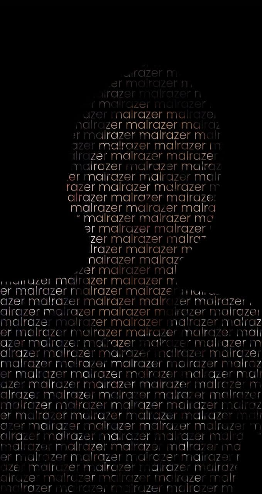

# How to use?
<p align="center">

</p>

You can create your text portrait using CSS

Go to this [**website**](https://malrazer.github.io/text-portrait-css/)

Then upload your picture

You can remove your background if you dont want text appear on your background picture

# Link Telegram
```
https://t.me/imbahere
```
